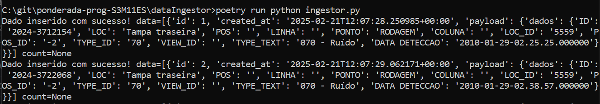
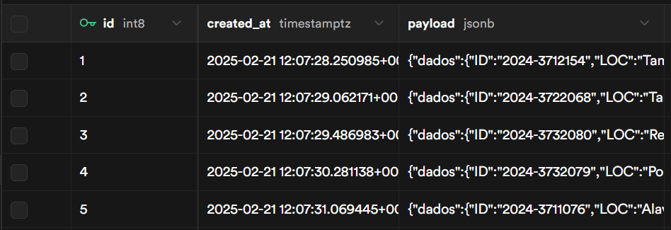
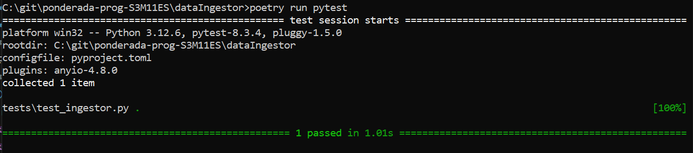

# Data Ingestor

Projeto para ingestão de dados de um arquivo CSV para o Supabase utilizando Python.

## Descrição
Este projeto implementa uma função para ler um arquivo CSV e inserir os dados em uma tabela do Supabase. Cada registro é enviado com um atraso de 0.1 segundos para controlar a taxa de envio. A comunicação com o Supabase é feita utilizando a biblioteca `supabase-py`.

## Estrutura do Projeto
A estrutura do projeto é a seguinte:

```
├── dataIngestor
│   ├── .env
│   ├── poetry.lock
│   ├── pyproject.toml
│   ├── README.md
│   ├── src
│   │   └── dataingestor
│   │           ├── __init__.py
│   │           └── ingestor.py
│   └── tests
│       └── test_ingestor.py
├── img
│   └── ...
└── README.md
```

## Requisitos
- Python 3.12 (ou superior)
- Poetry para gerenciamento de dependências
- Bibliotecas: supabase-py, python-dotenv, pytest

## Instalação
1. Clone o repositório:

```
git clone https://github.com/IsraelNLC/ponderada-prog-S3M11ES.git
```

2. Navegue até o diretório do projeto:

```
cd PONDERADA-PROG-S3M11ES
```

3. Instale as dependências utilizando o Poetry:

```
poetry install
```

4. Crie um arquivo `.env` na raiz do projeto com as variáveis de ambiente necessárias:

```env
SUPABASE_URL=<sua_url_supabase>
SUPABASE_KEY=<sua_chave_supabase>
```


## Uso
A função principal para ingestão de dados está localizada em `src/dataingestor/ingestor.py`. Você pode importar e utilizar essa função em seu código da seguinte forma:

```python
from src.dataingestor.ingestor import ingest_data

ingest_data("caminho/para/seu/arquivo.csv", "nome_da_tabela")
```

## Testes
Os testes foram desenvolvidos utilizando o framework `pytest` e estão localizados na pasta `tests/`. Para executar os testes, utilize o comando:

```
poetry run pytest
```

O teste utiliza `unittest.mock` para simular a leitura do arquivo CSV e a inserção de dados no Supabase, evitando chamadas reais à API.

## Evidências de Execução

1. Ingestão dos dados



2. Dados no Supabase



3. Execução dos testes



